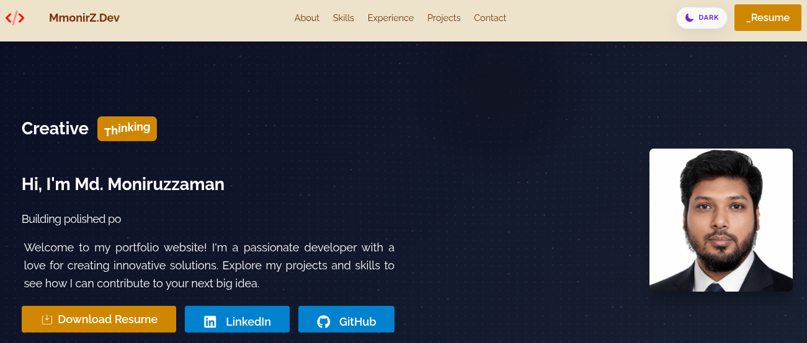

# 🚀 mmonirz.dev

<div align="center">


### 💼 Personal Portfolio Website of Mohammad Moniruzzaman

A modern, responsive, and high-performance developer portfolio showcasing my projects, skills, experience, and contact information.

🌐 **Live Demo:** https://mmonirz-dev.vercel.app/

</div>

---

## 📸 Preview



---

## ✨ Features

- 🎨 Modern & Responsive UI
- ⚡ Lightning-fast performance with Vite
- 🌙 Dark-themed design
- 📱 Mobile-friendly layout
- 🧑 About Me section
- 💼 Featured Projects
- 🛠 Skills & Technologies
- 📈 Experience Timeline
- 📞 Contact Form
- 🔗 Social Links
- 🎭 Smooth Animations
- 🚀 SEO Optimized

---

## 🛠 Tech Stack

| Category | Technologies |
|----------|--------------|
| Frontend | React, TypeScript |
| Styling | Tailwind CSS |
| Build Tool | Vite |
| Animation | Framer Motion |
| Icons | Lucide React |
| Deployment | Vercel |

---

## 📂 Folder Structure

```bash
mmonirz.dev
│
├── public/
├── src/
│   ├── assets/
│   ├── components/
│   ├── pages/
│   ├── layouts/
│   ├── hooks/
│   ├── utils/
│   ├── routes/
│   └── main.tsx
│
├── package.json
└── README.md
```

---

## 🚀 Getting Started

### Clone Repository

```bash
git clone https://github.com/Monirzkhan/mmonirz.dev.git
```

### Install Dependencies

```bash
npm install
```

### Run Development Server

```bash
npm run dev
```

### Build for Production

```bash
npm run build
```

---

## 📬 Contact

**Mohammad Moniruzzaman**

🌐 Website: https://mmonirz-dev.vercel.app/

GitHub: https://github.com/monirzkhan

LinkedIn:
https://linkedin.com/in/monizkhan-dev

Email:
mmonirz.dev@gmail.com

---

## ⭐ Support

If you like this project, consider giving it a ⭐ on GitHub!

---

## 📄 License

This project is licensed under the MIT License.